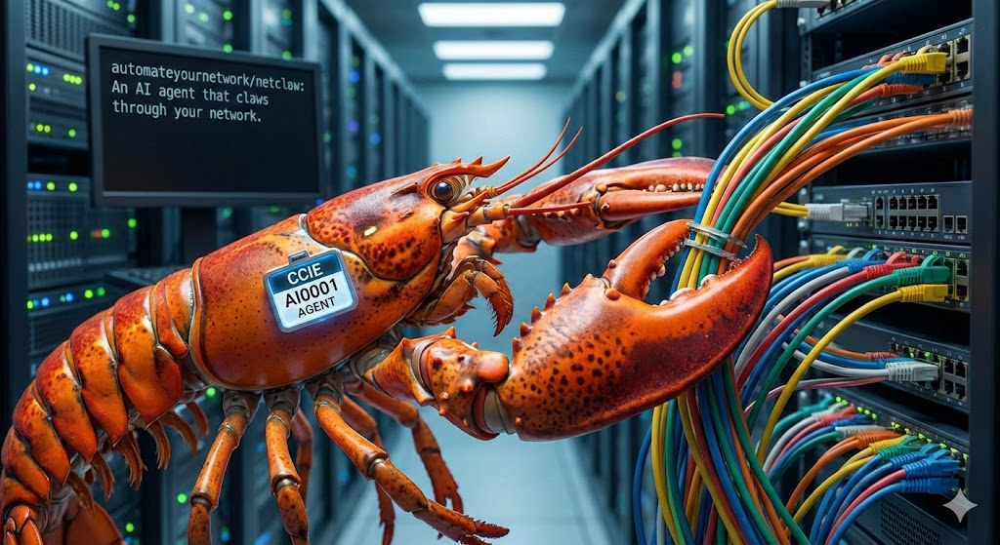

<p align="center">
  
</p>

# NetClaw Demo — Cisco DevNet NetGru Podcast

> **This is NOT the main NetClaw repository.** This is a fork configured specifically for the [Cisco DevNet NetGru Demo Podcast](https://www.youtube.com/watch?v=TsCuyOzrl0w). It exists to let viewers see exactly how NetClaw was set up for that demo.

## Use the real NetClaw instead

👉 **[github.com/automateyournetwork/netclaw](https://github.com/automateyournetwork/netclaw)** 👈

The upstream repo has the latest features, full documentation, installation wizard, and community support. Start there.

---

## What's different in this fork?

This repo contains the exact configuration used for the LocalEdge Datacenter demo environment shown in the NetGru podcast:

- **`config/openclaw-demo.json`** — MCP server config for the ephemeral demo VMs (Nautobot, protocol-mcp, ollama-experts, rfc-lookup)
- **`workspace/skills/netclaw-demo/`** — Locked-down skill set for the 4-hour demo sessions
- **`observability/`** — Vector + Prometheus remote-write pipeline for token usage metrics
- **`mcp-servers/ollama-experts/`** — Local Ollama domain expert delegation (FRR, BGP, OSPF, Nautobot, RFC validation)
- **`testbed/`** — ContainerLab FRR testbed topology (6 routers: PE1, P1–P4, RR1)

The demo runs on [LocalEdge Datacenter](https://localedgedatacenter.com) infrastructure — ephemeral VMs with a 4-hour TTL, automated provisioning via Proxmox + Cloudflare Tunnels, and self-destructing environments.

## Demo environment overview

```
┌─────────────────────────────────────────────────────────┐
│  Demo VM (4hr TTL, auto-provisioned)                    │
│                                                         │
│  OpenClaw Gateway ──► Claude claude-sonnet-4-5-20250929          │
│       │                                                 │
│       ├── nautobot-mcp ──► Nautobot (localhost:8080)    │
│       ├── nautobot-routing-mcp ──► BGP/OSPF models     │
│       ├── protocol-mcp ──► Live OSPF/BGP speakers      │
│       ├── ollama-experts ──► Local GPU domain models    │
│       └── rfc-lookup ──► IETF RFC search               │
│                                                         │
│  ContainerLab ──► 6x FRR routers (MPLS/BGP/OSPF)      │
│  Nautobot ──► Source of truth (devices, IPs, BGP)      │
│  NetClaw Visual ──► Three.js 3D ops dashboard          │
└─────────────────────────────────────────────────────────┘
```

## Running this yourself

If you want to replicate the demo environment:

1. **Start with the real NetClaw** — clone [automateyournetwork/netclaw](https://github.com/automateyournetwork/netclaw) and run `./scripts/install.sh`
2. **Copy the demo config** — use `config/openclaw-demo.json` as a reference for which MCP servers to enable
3. **Set up ContainerLab** — deploy the topology in `lab/frr-testbed/`
4. **Deploy Nautobot** — use [nautobot-docker-compose](https://github.com/nautobot/nautobot-docker-compose) with the routing models plugin
5. **Set environment variables** — see `.env.example` for all required vars

## Credits

- **NetClaw** by [John Capobianco](https://github.com/automateyournetwork) — the upstream project
- **OpenClaw** — the AI agent framework NetClaw runs on
- **Demo infrastructure** by [Byrn Baker](https://github.com/byrn-baker) / [LocalEdge Datacenter](https://localedgedatacenter.com)

## License

BSL-1.1 (Business Source License) — same as upstream NetClaw. Converts to Apache-2.0 after the change date.
