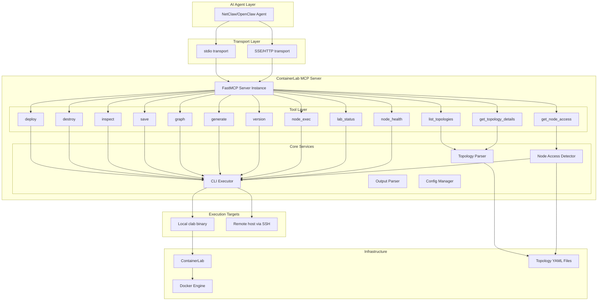
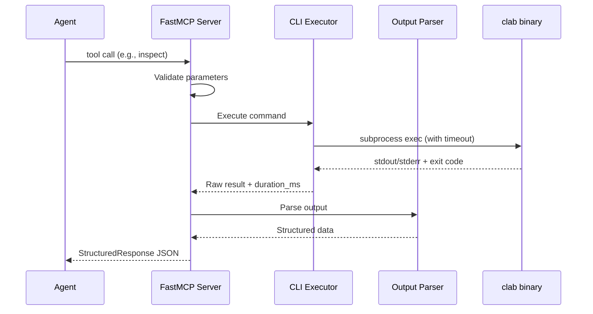
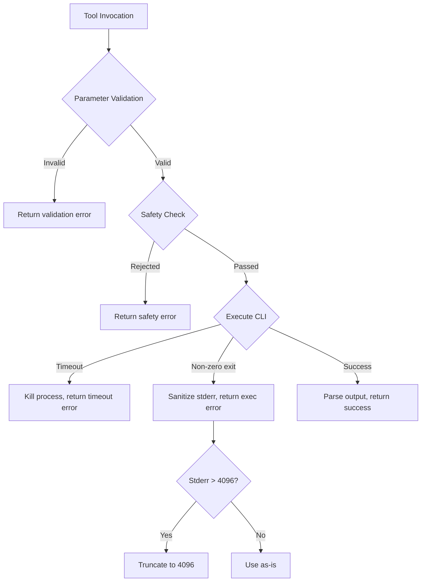

# Design Document: ContainerLab MCP Server

## Overview

The ContainerLab MCP Server is a Python-based MCP server built on the `mcp` SDK's FastMCP pattern. It wraps the `clab` CLI binary, exposing all ContainerLab operations as structured MCP tools consumable by AI agents within the NetClaw/OpenClaw ecosystem.

The server acts as a bridge between AI agents and ContainerLab infrastructure — translating high-level tool calls into CLI invocations, parsing raw output into structured JSON, and enriching responses with node access metadata derived from topology YAML files.

### Key Design Decisions

1. **FastMCP over low-level server**: Uses the `@mcp.tool()` decorator pattern for cleaner tool definitions with automatic schema generation from type hints and Pydantic models.
2. **Subprocess execution over library integration**: ContainerLab is a Go binary with no Python bindings. All interaction goes through `asyncio.create_subprocess_exec`.
3. **Pydantic response models**: Every tool returns a typed response model, enabling structured output and consistent error handling.
4. **Async-first**: All CLI execution and SSH operations are async, supporting concurrent agent connections in SSE/HTTP mode.
5. **Configuration layering**: Environment variables > CLI args > config file, following 12-factor app principles.

## Architecture



### Component Interaction Flow



## Components and Interfaces

### 1. FastMCP Server (`server.py`)

The entry point that initializes the FastMCP instance and registers all tools.

```python
from mcp.server.fastmcp import FastMCP

mcp = FastMCP(
    "containerlab-mcp",
    instructions="ContainerLab MCP server for managing container-based network lab topologies"
)
```

**Responsibilities:**
- Server lifecycle management (startup checks, lifespan context)
- Tool registration via decorators
- Transport selection (stdio vs SSE/HTTP)
- Configuration loading

### 2. CLI Executor (`executor.py`)

Handles all subprocess and SSH execution with timeout management.

```python
class CLIExecutor:
    async def execute(
        self,
        args: list[str],
        timeout: float = 30.0,
        cwd: str | None = None
    ) -> ExecutionResult: ...
    
    async def execute_remote(
        self,
        args: list[str],
        timeout: float = 120.0
    ) -> ExecutionResult: ...
```

**Responsibilities:**
- Local subprocess execution via `asyncio.create_subprocess_exec`
- Remote execution via SSH (asyncssh)
- Timeout enforcement and process termination
- Duration measurement (wall-clock ms)
- stdout/stderr capture

### 3. Output Parser (`parser.py`)

Converts raw CLI output into structured data.

```python
class OutputParser:
    def parse_table(self, raw: str) -> list[dict[str, str]]: ...
    def parse_json(self, raw: str) -> dict | list: ...
    def parse_inspect(self, raw: str) -> list[NodeInfo]: ...
```

**Responsibilities:**
- Table-to-JSON conversion for `clab inspect` output
- JSON pass-through for commands with `--format json` support
- Column header normalization (lowercase, snake_case)
- Empty table detection (zero data rows → empty array)

### 4. Topology Parser (`topology.py`)

Reads and validates topology YAML files.

```python
class TopologyParser:
    def discover(self, search_paths: list[str], max_depth: int = 3) -> list[TopologyEntry]: ...
    def parse(self, path: str) -> TopologyDetails: ...
    def get_node_kinds(self, path: str) -> dict[str, str]: ...
```

**Responsibilities:**
- Recursive directory scanning for `.clab.yml` files
- YAML parsing and schema validation
- Node kind extraction for access method detection
- Topology metadata extraction (lab name, node count, links)

### 5. Node Access Detector (`access.py`)

Determines how to connect to each node based on topology definitions.

```python
class NodeAccessDetector:
    def detect(self, topology_path: str, node_name: str) -> NodeAccessInfo: ...
    def detect_all(self, topology_path: str, inspect_data: list[NodeInfo]) -> list[NodeAccessInfo]: ...
```

**Responsibilities:**
- Access method classification (SSH, docker exec, clab connect)
- Credential extraction from topology YAML (node-level > topology defaults)
- Connection command string generation
- Management IP extraction from inspect data

### 6. Configuration Manager (`config.py`)

Loads and merges configuration from multiple sources.

```python
class ConfigManager:
    def load(self) -> ServerConfig: ...
```

**Responsibilities:**
- Environment variable reading (`CLAB_MCP_*` prefix)
- CLI argument parsing
- Config file loading (YAML/JSON)
- Priority-based merging (env > CLI > file)
- Default value population

### 7. Safety Gate (`safety.py`)

Validates confirmation parameters for destructive operations.

```python
class SafetyGate:
    def validate_destroy(
        self,
        target_name: str,
        confirm_topology_name: str | None,
        cleanup: bool,
        confirm_cleanup: bool | None
    ) -> ValidationResult: ...
```

**Responsibilities:**
- Exact string matching for topology name confirmation
- Cleanup flag validation
- Error message generation for mismatches

## Data Models

### Response Models

```python
from pydantic import BaseModel, Field
from typing import Literal

class StructuredResponse(BaseModel):
    """Base response for all tool invocations."""
    status: Literal["success", "error"]
    data: dict | list | None = None
    command: str = Field(description="The CLI command that was executed")
    duration_ms: int = Field(ge=0, description="Execution time in milliseconds")
    message: str | None = Field(default=None, description="Error message when status is error")
    code: int | None = Field(default=None, description="Exit code on error")

class ExecutionResult(BaseModel):
    """Internal result from CLI execution."""
    stdout: str
    stderr: str
    exit_code: int
    duration_ms: int
    command: str

class NodeExecResponse(BaseModel):
    """Response from node_exec tool."""
    status: Literal["success", "error"]
    stdout: str
    stderr: str
    exit_code: int
    command: str
    duration_ms: int
```

### Topology Models

```python
class TopologyEntry(BaseModel):
    """Discovered topology file metadata."""
    path: str = Field(description="Absolute path to the .clab.yml file")
    lab_name: str = Field(description="Lab name derived from topology")
    node_count: int = Field(ge=0, description="Number of nodes defined")

class TopologyDetails(BaseModel):
    """Parsed topology content."""
    name: str
    nodes: list[NodeDefinition]
    links: list[LinkDefinition]
    kind: str | None = None

class NodeDefinition(BaseModel):
    """A node within a topology."""
    name: str
    kind: str
    image: str | None = None
    startup_config: str | None = None
    
class LinkDefinition(BaseModel):
    """A link between two endpoints."""
    endpoints: list[str]
```

### Node Access Models

```python
class NodeAccessInfo(BaseModel):
    """Access information for a running node."""
    node_name: str
    container_id: str
    mgmt_ipv4: str | None = None
    mgmt_ipv6: str | None = None
    access_method: Literal["ssh", "docker_exec", "clab_connect"]
    connection_command: str = Field(
        description="Shell-ready command to access the node"
    )
    username: str | None = None
    password: str | None = None
```

### Configuration Models

```python
class ServerConfig(BaseModel):
    """Server runtime configuration."""
    transport: Literal["stdio", "sse"] = "stdio"
    host: str = "0.0.0.0"
    port: int = Field(default=8080, ge=1, le=65535)
    topology_paths: list[str] = Field(default_factory=lambda: ["."])
    log_level: Literal["debug", "info", "warning", "error"] = "info"
    remote: str | None = None  # user@host
    ssh_key_path: str | None = None
    ssh_port: int = 22

class LabInstance(BaseModel):
    """A running lab deployment."""
    topology_name: str
    node_count: int
    deployed_at: str  # ISO 8601 UTC

class NodeHealth(BaseModel):
    """Container resource usage for a node."""
    node_name: str
    cpu_percent: float = Field(ge=0.0, le=100.0)
    memory_bytes: int = Field(ge=0)
    memory_percent: float = Field(ge=0.0, le=100.0)
    uptime_seconds: int = Field(ge=0)
```

## Correctness Properties

*A property is a characteristic or behavior that should hold true across all valid executions of a system — essentially, a formal statement about what the system should do. Properties serve as the bridge between human-readable specifications and machine-verifiable correctness guarantees.*

### Property 1: Response Schema Invariant

*For any* tool invocation (regardless of which tool is called and whether it succeeds or fails), the returned JSON object SHALL contain a `status` field with value "success" or "error", a `command` field containing the executed CLI command string, and a `duration_ms` field that is a non-negative integer. If status is "success", a `data` field SHALL be present. If status is "error", a `message` field SHALL be present.

**Validates: Requirements 1.9, 4.1, 4.4**

### Property 2: Table Parsing Correctness

*For any* well-formed table output consisting of a header row and zero or more data rows (where columns are separated by consistent whitespace or delimiters), parsing SHALL produce a JSON array where each element is an object with keys matching the normalized (lowercase snake_case) column headers and values matching the corresponding row cells. A table with zero data rows SHALL produce an empty array.

**Validates: Requirements 4.2, 4.6**

### Property 3: Topology Discovery Depth Limit

*For any* directory tree containing `.clab.yml` files at various depths, the `list_topologies` tool SHALL discover all topology files at depth ≤ 3 relative to the search path root AND SHALL NOT discover any topology files at depth > 3. Every discovered entry SHALL include a valid absolute path, a non-empty lab name, and a node count ≥ 0.

**Validates: Requirements 2.1, 2.2**

### Property 4: Topology Parsing Round-Trip

*For any* valid topology structure (with valid node definitions, link definitions, and optional kind), serializing it to YAML and then parsing it with `get_topology_details` SHALL produce a result where the node names, node kinds, link endpoints, and topology name match the original structure.

**Validates: Requirements 2.3**

### Property 5: Destroy Safety Gate

*For any* topology name, confirmation string, cleanup flag, and cleanup confirmation value: the destroy operation SHALL only proceed to CLI execution when (a) `confirm_topology_name` exactly matches the target topology name (case-sensitive), AND (b) if `cleanup` is true, `confirm_cleanup` is also true. All other combinations SHALL result in rejection without any CLI command being executed.

**Validates: Requirements 5.1, 5.2, 5.3, 5.4**

### Property 6: Node Access Method Detection

*For any* topology with nodes of known kinds (e.g., srl, ceos, crpd → SSH; linux → docker_exec; rare/serial → clab_connect), the detected access method SHALL match the expected pattern for that kind. The response SHALL always include node_name, access_method, and a non-empty connection_command string. If the access method is SSH, username and password SHALL be populated from the topology YAML.

**Validates: Requirements 3.1, 3.2, 3.3**

### Property 7: Credential Precedence

*For any* topology where credentials are defined at both the node level and the topology defaults level, the `get_node_access` response SHALL use the node-level credentials. If credentials exist only at the topology defaults level, those SHALL be used. If no credentials are found at either level, the access method SHALL fall back to "docker_exec".

**Validates: Requirements 3.4**

### Property 8: Error Response Sanitization

*For any* CLI error output containing absolute file paths (matching `/...` patterns) or credential-like strings (passwords, tokens, keys), the error message returned to the agent SHALL NOT contain those sensitive values. The message SHALL still convey a meaningful failure reason.

**Validates: Requirements 1.10**

### Property 9: Stderr Truncation

*For any* CLI execution that produces stderr output, if the stderr length exceeds 4096 characters, the `message` field in the error response SHALL be truncated to exactly 4096 characters. If stderr is ≤ 4096 characters, it SHALL be included in full.

**Validates: Requirements 4.3**

### Property 10: Configuration Precedence

*For any* configuration setting that is defined in multiple sources (environment variable, CLI argument, config file), the effective value SHALL be determined by priority: environment variable wins over CLI argument, which wins over config file value.

**Validates: Requirements 8.1**

### Property 11: Colon-Separated Path Parsing

*For any* list of 1 to 64 directory path strings (not containing colons) joined by the colon character, parsing `CLAB_MCP_TOPOLOGY_PATHS` SHALL produce the original list with identical ordering and values.

**Validates: Requirements 8.2**

### Property 12: Log Level Parsing

*For any* string that is a case-insensitive match of "debug", "info", "warning", or "error", the server SHALL accept it as a valid log level. *For any* string that does not match any valid level (case-insensitive), the server SHALL fall back to "info".

**Validates: Requirements 8.4, 8.5**

### Property 13: Invalid Transport Rejection

*For any* string value for the `--transport` argument that is not "stdio" and not "sse", the server SHALL exit with a non-zero exit code.

**Validates: Requirements 6.6**

### Property 14: Command Length Validation

*For any* command string passed to `node_exec`, if the string length exceeds 4096 characters, the tool SHALL reject the invocation with an error response. If the string length is ≤ 4096 characters (and the node exists), the command SHALL be accepted for execution.

**Validates: Requirements 1.8**

### Property 15: Tool Schema Completeness

*For any* registered MCP tool in the server, the tool schema SHALL include: a description of no more than 120 characters, all parameters documented with types and required/optional designation, and at least one usage example. Every parameter name SHALL be in snake_case and consist of at least two words or at least 8 characters.

**Validates: Requirements 10.1, 10.2, 10.3**

### Property 16: Invalid Node Error Includes Valid Names

*For any* deployed lab with a known set of node names, calling `node_exec` or `get_node_access` with a node name not in that set SHALL return an error response that includes the complete list of valid node names.

**Validates: Requirements 3.6**

## Error Handling

### Error Categories

| Category | HTTP-equivalent | Example | Response Pattern |
|----------|----------------|---------|-----------------|
| Validation Error | 400 | Missing required param, command too long | `status: "error"`, descriptive message |
| Not Found | 404 | Node not in lab, topology file missing | `status: "error"`, message + valid alternatives |
| Safety Rejection | 403 | Destroy confirmation mismatch | `status: "error"`, mismatch explanation |
| Execution Error | 500 | CLI non-zero exit, subprocess crash | `status: "error"`, sanitized stderr, exit code |
| Timeout | 504 | CLI > 30s, SSH > 30s connect, remote > 120s | `status: "error"`, timeout message |
| Configuration Error | N/A | clab binary missing, bad log level | Server exits with non-zero code + log message |

### Error Flow



### Sanitization Rules

Error messages exposed to agents must never contain:
- Absolute filesystem paths from the host (replace with `<path>` or relative paths)
- SSH credentials (passwords, key file contents)
- Docker socket paths or internal container IDs beyond what's operationally useful
- Stack traces (log internally at debug level, return user-friendly message)

### Timeout Strategy

| Operation | Timeout | Rationale |
|-----------|---------|-----------|
| Local CLI command | 30s | Most clab commands complete in < 10s |
| SSH connection | 30s | Network issues should surface quickly |
| Remote CLI command | 120s | Deploy/destroy on large topologies can be slow |
| node_exec | 30s | Interactive commands shouldn't block the agent |

## Testing Strategy

### Property-Based Testing

**Library:** [Hypothesis](https://hypothesis.readthedocs.io/) (Python's standard PBT library)

**Configuration:**
- Minimum 100 examples per property test
- Each test tagged with: `# Feature: containerlab-mcp, Property {N}: {title}`
- Custom strategies for topology YAML generation, table output generation, and path string generation

**Property tests cover:**
- Response schema validation across all tools (Property 1)
- Table parsing with generated table data (Property 2)
- Directory depth discovery (Property 3)
- Topology YAML round-trip (Property 4)
- Destroy safety gate logic (Property 5)
- Access method detection mapping (Property 6)
- Credential precedence (Property 7)
- Error sanitization (Property 8)
- Stderr truncation (Property 9)
- Config precedence (Property 10)
- Path parsing (Property 11)
- Log level parsing (Property 12)
- Transport validation (Property 13)
- Command length validation (Property 14)
- Tool schema invariants (Property 15)
- Invalid node error content (Property 16)

### Unit Tests (Example-Based)

Focus areas:
- Specific CLI output samples from each clab subcommand (inspect, version, deploy)
- Known topology files with specific node kinds → expected access methods
- Edge cases: empty tables, single-node topologies, topologies without credentials
- Port conflict detection on startup
- clab binary missing at startup

### Integration Tests

Focus areas:
- Full lifecycle: deploy → inspect → node_exec → destroy (against real clab + Docker)
- SSH remote execution against a local SSH server mock
- SSE/HTTP transport with 10 concurrent connections
- Lab status with containers in various states (running, exited, paused)

### Test Organization

```
tests/
├── unit/
│   ├── test_parser.py          # Table/JSON parsing
│   ├── test_topology.py        # YAML parsing, discovery
│   ├── test_access.py          # Access method detection
│   ├── test_safety.py          # Destroy confirmation
│   └── test_config.py          # Config loading/precedence
├── property/
│   ├── test_response_schema.py # Property 1
│   ├── test_table_parsing.py   # Property 2
│   ├── test_discovery.py       # Properties 3, 4
│   ├── test_safety_gate.py     # Property 5
│   ├── test_access_detect.py   # Properties 6, 7
│   ├── test_error_handling.py  # Properties 8, 9
│   ├── test_config.py          # Properties 10, 11, 12, 13
│   ├── test_validation.py      # Property 14
│   └── test_schema.py          # Properties 15, 16
└── integration/
    ├── test_lifecycle.py       # Full deploy/inspect/destroy
    ├── test_ssh_remote.py      # Remote execution
    └── test_transport.py       # SSE concurrent connections
```

